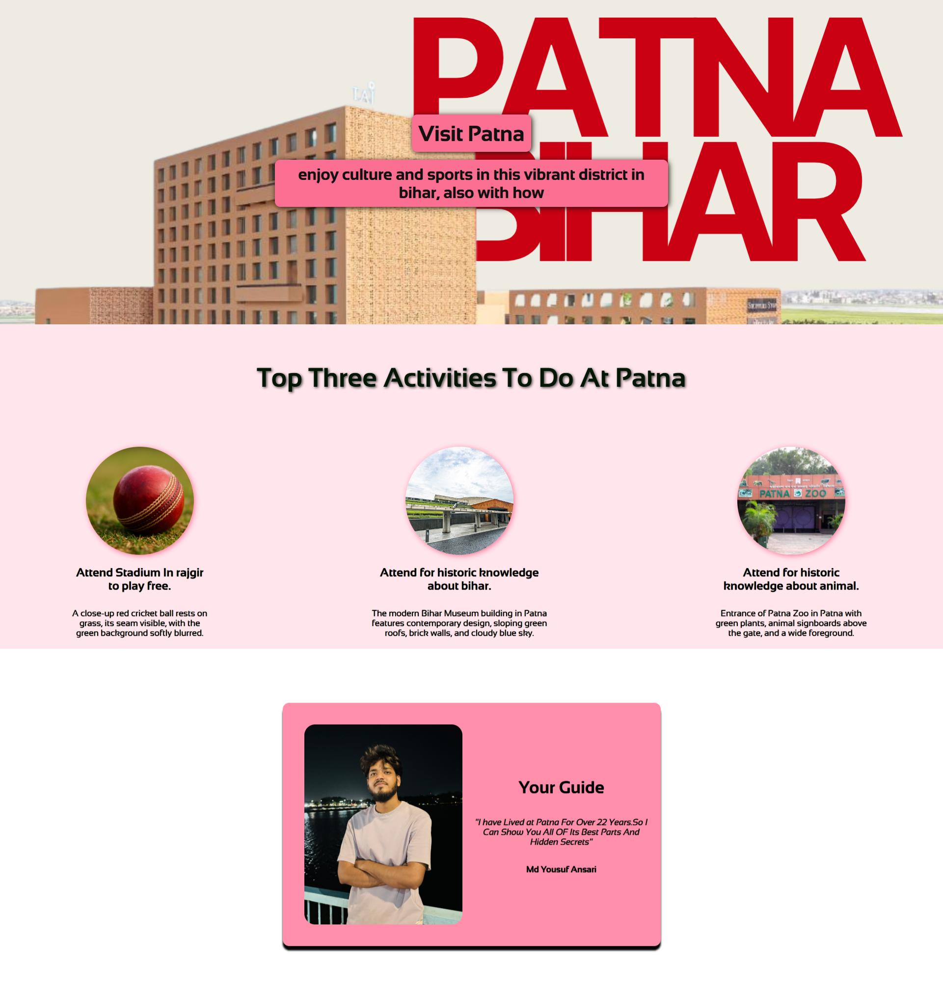

---

# hometown-basic

A simple and charming **Hometown Webpage** that gives a quick introduction to who you are and where you come from—a digital shoutout to your roots!

---

## Preview

<p align="center">
  
</p>


---

## About

A basic static page where I introduce myself and share a little about my hometown—made with basic web technologies to keep it lightweight and accessible.

---

## Features

* **Clean, minimalistic design** using just HTML & CSS.
* **Responsive layout** that looks good on both desktop and mobile.
* **Personal touch**, with sections to showcase your hometown, favorite landmarks, or memories.
* **Easy to customize**—just update the HTML, tweak the CSS, and it’s yours.

---

## Tech Stack

* **HTML5** – Structure and content
* **CSS3** – Styling, layout, responsiveness

---

## Structure & How to Run

```bash
git clone https://github.com/srcastt/hometown-basic.git
cd hometown-basic
open index.html   # Mac
start index.html  # Windows
# or simply open it in your browser
```

The repository contains:

```
├── index.html      # Main page with your introduction
├── styles.css      # Styling and layout
├── images/         # Place your hometown photos or icons here
└── LICENSE         # MIT license information
```

---

## Customize It

1. **Edit `index.html`** to personalize your message—tell us about your hometown, your favorite places, or what makes it special.
2. **Tweak `styles.css`**—change fonts, colors, layout, or even add new sections.
3. **Add visuals**—drop in photos or icons into `images/` and reference them in your HTML to make it more engaging.

---

## License

This project is licensed under the **MIT License**, meaning you’re free to use, modify, or share it as you like.

---

## Author

Crafted with care by **srcastt**.

---
